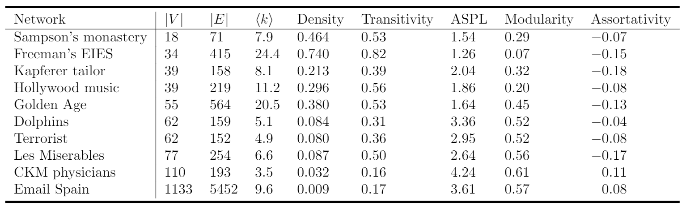

# Social Networks Collection

### What is this? 

This repository serves as a collection of 37 (*last updated this: 2020-08-31*) social and information networks that I have investigated during my research, primarily during my [M.S. thesis](https://scholarworks.uvm.edu/cgi/viewcontent.cgi?article=2240&context=graddis) at the [University of Vermont](https://www.uvm.edu/). Many of the networks are relatively small (0-1,000 nodes), but a few have as many as 100,000 nodes. These networks describe collaborations (musicians, scientists, etc.), friendships (human, animal, and fictional), blogging, emails, and more! Obviously there are many more networks that could be included; my criteria for selecting networks was a weighted combination of: (i) relatively small size, (ii) personally interesting, (iii) popularity/citations, (iv) usefulness/importance. **Code is written in Python and networkx is used to load the networks.**

### Why is this useful? 

Many hours were spent finding, downloading, understanding, preprocessing, and loading these networks. In particular, downloading networks from disparate sources gives a range of file formats which have to be read in different ways. These lengthy steps present a significant barrier for researchers trying to quickly utilize several networks. Note: there are a couple similar projects which are worth checking into (i.e. Pajek).

I hope this can be a quick way to load and analyze some interesting social networks, particularly for people who are learning data science/social network analysis. You could study a single network or examine properties of the whole collection. Advanced researchers may use the whole collection for testing network algorithms or visualizations.

### Important notes

1. During my research, I preprocessed the networks so that they were undirected, unweighted, static, and connected. I also disregarded metadata if it was provided. In the future, I will make such options configurable.

2. The information in `network_descriptions.JSON` is not always accurate because it corresponds to the raw data (before preprocessing). Also, I copied the descriptions from the sources I got them -- so they may include typos or not be very informative. I hope to clean this up eventually.

# Usage

~~You can install the python package via `pip install social-networks-collection`~~ 🛑 **NOT READY YET!** 🛑

1. To show network details and load into a networkx Graph

```python
from read_networks import read_any, get_network_info, NETWORKS_DICT

#list all network names
print(list(NETWORKS_DICT.keys()))

#pick a network name and get more information
name = "Sampson's monastery"
print(get_network_info(name))

#load the network
G = read_any(name)
```

2. To visualize a network (see `communities_visualization.py` for a more complex example)
```python
import networkx as nx
import matplotlib.pyplot as plt

nx.draw(G)
plt.show()
```

3. To compute network statistics (see `compute_network_stats.py` for details & further usage)
```python
print("nodes:", nx.number_of_nodes(G))
print("edges:", nx.number_of_edges(G))
print("density:", density(G))

#alternatively, pick from a list of useful functions provided in STATS_DICT
from compute_network_stats import STATS_DICT 
print(list(STATS_DICT.keys()))

#these three lines are equivalent to the three earlier print statements
print("nodes:", STATS_DICT["num_nodes"](G))
print("edges:", STATS_DICT["num_edges"](G))
print("density:", STATS_DICT["density"](G))

#STATS_DICT gives easy access to more complex functions such as modularity
print("modularity:", STATS_DICT["modularity"](G))
```


# Sources
Each network has a citation which can be accessed as follows
```python
from read_networks import read_any, get_network_info, NETWORKS_DICT
name = "Sampson's monastery"
print(get_network_info(name)["citation"])
```

### Below is an extensive list of network databases

- Colorado Index of Complex Networks (ICON): https://icon.colorado.edu/#!/networks
- KONECT (the Koblenz Network Collection): http://konect.cc/networks/
- Stanford Network Analysis Project (SNAP) ~ Stanford Large Network Dataset Collection: https://snap.stanford.edu/data/index.html
- Pajek Datasets: http://vlado.fmf.uni-lj.si/pub/networks/data/
    - Exploratory Social Network Analysis with Pajek:  
 http://vlado.fmf.uni-lj.si/pub/networks/data/esna/default.htm
    - UCINET IV Datasets: http://vlado.fmf.uni-lj.si/pub/networks/data/ucinet/ucidata.htm
- Personal web pages
    - Mark Newman: http://www-personal.umich.edu/~mejn/netdata/
    - Tore Opsahl: https://toreopsahl.com/datasets/
    - Uri Alon: https://www.weizmann.ac.il/mcb/UriAlon/download/collection-complex-networks
    - Alex Arenas: https://deim.urv.cat/~alexandre.arenas/data/welcome.htm
    - Albert-László Barabási:
http://networksciencebook.com/translations/en/resources/data.html
- More UCI Datasets: 
    - http://moreno.ss.uci.edu/data.html
    - https://sites.google.com/site/ucinetsoftware/datasets

# Summary statistics for a few networks



# Improvements
This repository is still in its infancy. Apart from including more networks, the code here can be improved a lot. 

### General 
- Allow for configuring graph options: undirected/directed, unweighted/weighted, different versions of some networks.
- Converting the edgelist/adjacency matrices to all be in the same format could greatly shorten the code for all the `read_*()` functions. Removing unused raw data could save space on Github.
- Improve the info returned by `get_network_info()`, such as returning additional notes about preprocessing.

### Software development best-practices & organization
- More extensive comments detailing function inputs & outputs. Improve documentation & test examples.
- Objective-oriented approach might be better (I started this in `network.py`...) -- especially if this grows into a bigger product.
- Lowering strictness of `requirements.txt`; have yet to test with other versions.
- Reorganizing utilities (`edge_clustering_coeff.py`, `modularity.py`, etc.) and global variables (NETWORKS_DICT, STATS_DICT, SMALL_NETWORKS).
